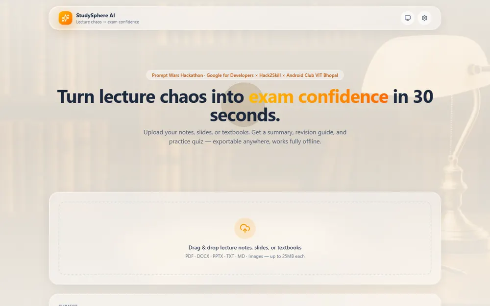
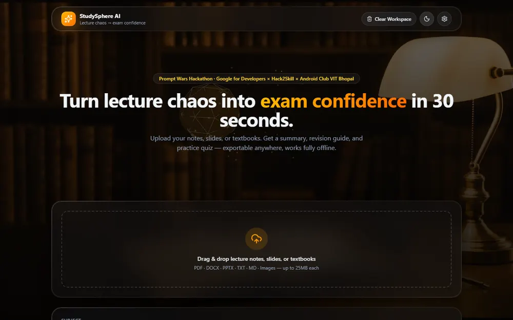
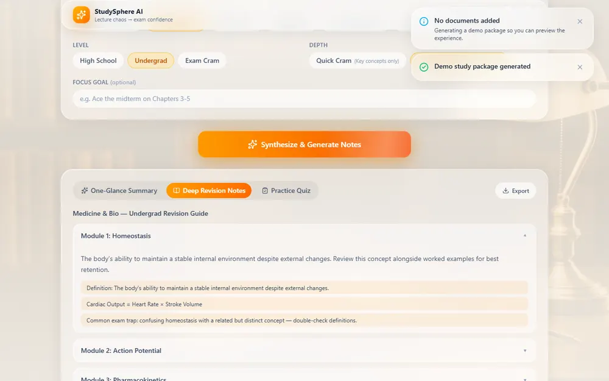
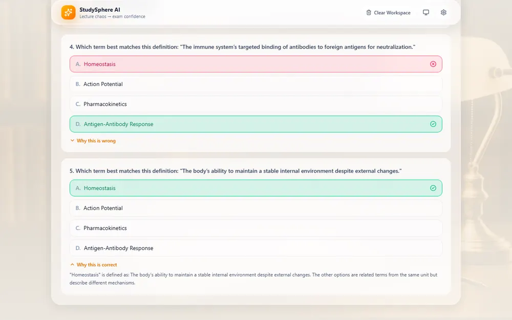
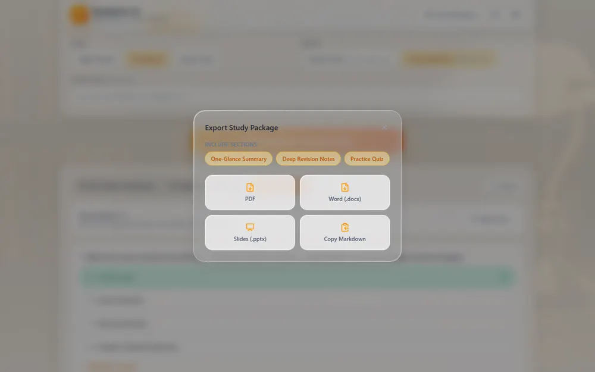

<div align="center">

# StudySphere AI

**Turn lecture chaos into exam confidence in 30 seconds.**

Drop in lecture notes, slides, or textbooks and get an executive summary, structured revision notes, and an interactive practice quiz — exportable to PDF, Word, PowerPoint, or Markdown. Works fully offline, and never dead-ends the user.

Built for the **Prompt Wars Hackathon** — Google for Developers × Hack2Skill × Android Club VIT Bhopal

[](https://react.dev)
[](https://www.typescriptlang.org)
[](https://vite.dev)
[](https://tailwindcss.com)
[](https://web.dev/progressive-web-apps/)

</div>

<br>

<table>
<tr>
<td width="50%"></td>
<td width="50%"></td>
</tr>
<tr>
<td width="50%"></td>
<td width="50%"></td>
</tr>
</table>

## Contents

- [What it does](#what-it-does)
- [Why it won't crash on you](#why-it-wont-crash-on-you)
- [Quick start](#quick-start)
- [AI configuration](#ai-configuration)
- [Deploying the shared AI proxy (Vercel)](#deploying-the-shared-ai-proxy-vercel)
- [Tech stack](#tech-stack)
- [Project structure](#project-structure)

## What it does

1. **Ingest** — drag and drop `.pdf`, `.docx`, `.pptx`, `.txt`, `.md`, or images (up to 25MB each). Everything is parsed client-side; nothing is uploaded to a server just to read it.
2. **Personalize** — pick a subject (CS, Medicine, Law, Engineering, Business, Math, or your own), a level (High School / Undergrad / Exam Cram), a depth (Quick Cram vs. Comprehensive), and an optional focus goal.
3. **Synthesize** — get three views of the same material:
   - **One-Glance Summary** — a TL;DR, high-impact takeaways, and key term/definition pairs.
   - **Deep Revision Notes** — structured, collapsible modules built directly from your source material's actual paragraphs (not generic filler).
   - **Practice Quiz** — 4–5 multiple-choice questions with instant feedback, a scored result, confetti on a perfect run, and an explanation for every answer.
4. **Export** — one click to a branded PDF, a `.docx` with proper headings/bullets, an auto-paginated `.pptx` deck, or Markdown copied to your clipboard. Every format includes the quiz answer key with explanations.

<p align="center"></p>

## Why it won't crash on you

- **Every file parses independently.** One corrupted or password-protected upload can't take down the batch — it's flagged and skipped.
- **AI calls retry with exponential backoff**, then gracefully fall back to a fully offline mock generator if Gemini is unreachable, rate-limited, or misconfigured. Judges can try the entire flow with zero setup — Demo Mode is on by default.
- **A top-level Error Boundary** catches render failures and offers Retry / Switch to Demo Mode instead of a blank screen.
- **All destructive actions require confirmation-free but deliberate clicks** — a single "Clear Workspace" button wipes the session (IndexedDB cache + in-memory state) with nothing lingering behind.

## Quick start

```bash
npm install
npm run dev
```

That's it — Demo Mode is on by default, so upload → generate → export all work immediately with no API key, no account, and no internet dependency.

## AI configuration

The app tries three sources for generation, in order, and falls back automatically if one fails:

| # | Source | Requires | Notes |
|---|---|---|---|
| 1 | Your own Gemini API key | A key pasted into Settings | Calls Gemini directly from the browser; the key lives only in `localStorage` |
| 2 | StudySphere's shared AI | Nothing | Routes through a serverless proxy holding a server-side key — see below |
| 3 | Offline mock generator | Nothing | Builds real structure from your uploaded text with zero network calls |

## Deploying the shared AI proxy (Vercel)

`api/generate.ts` is a Vercel serverless function. An API key given to a static frontend is always publicly visible in the shipped JS — this proxy is the only way to offer real AI output without every visitor bringing their own key.

1. Deploy this repo to Vercel — it auto-detects Vite and the `api/` function, zero config needed.
2. In **Project Settings → Environment Variables**, add:
   ```
   GEMINI_API_KEY=<your key>
   ```
   Do **not** prefix it with `VITE_` — that tells Vite to inline the value into the public bundle, defeating the entire point.
3. Redeploy. Visitors who haven't entered their own key now get real Gemini output via the proxy.

The function includes a soft per-instance rate limit (8 requests / 10 minutes / IP) as a deterrent against casual abuse of the shared key. It resets on cold start and doesn't coordinate across concurrent instances — for real production traffic, swap it for Vercel KV or Upstash. `.env.example` documents the variable, and `.gitignore` blocks every `.env*` file from ever being committed.

If you deploy elsewhere without a matching serverless function, `/api/generate` simply 404s and the app falls back to Demo Mode automatically — nothing breaks.

## Tech stack

| Layer | Choices |
|---|---|
| Framework | React 19, TypeScript, Vite 8 |
| Styling | Tailwind CSS v4, custom liquid-glass utilities, Framer Motion |
| 3D | `@react-three/fiber` + `@react-three/drei` (hero orb, mouse-follow + particles) |
| Document parsing | `pdfjs-dist`, `mammoth`, `jszip` — all client-side |
| Export engines | `jspdf` + `jspdf-autotable`, `docx`, `pptxgenjs` |
| AI | `@google/genai` (Gemini, JSON-schema-enforced output) |
| Storage | `idb-keyval` for TTL'd session caching |
| PWA | `vite-plugin-pwa` (Workbox), installable, offline-capable |
| Serverless | Vercel Node function for the shared AI proxy |

## Project structure

```
src/
  components/     UI components (Dropzone, QuizView, ExportModal, ThreeCanvas, ...)
  hooks/          useFileManager, useTheme, useToasts, useInstallPrompt, ...
  services/       fileParser.ts, aiService.ts, exportService.ts, storage.ts
  lib/            promptBuilder.ts — shared between the client and the serverless proxy
api/
  generate.ts     Vercel serverless function (shared AI proxy)
```
